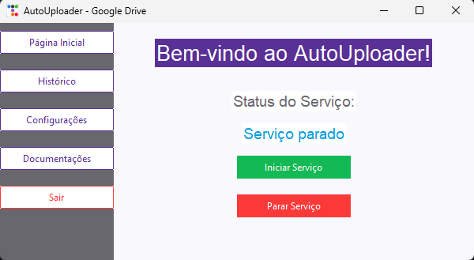

# 🌐 Python - PrintScreen Google Driver (automação)
<div align="center">
  
</div>

<p align="center">
  <a href="https://github.com/guedes-jr/python-PrintScreenDriver">
    
  </a>
  <a href="https://github.com/guedes-jr/python-PrintScreenDriver/issues">
    
  </a>
  <a href="https://github.com/guedes-jr/python-PrintScreenDriver/network">
    
  </a>
  <a href="https://github.com/guedes-jr/python-PrintScreenDriver/stargazers">
    
  </a>
  <a href="https://github.com/guedes-jr/python-PrintScreenDriver/blob/main/LICENSE">
    
  </a>
</p>

## 📝 Sumário

- [Sobre o Projeto](#%EF%B8%8Fsobre-o-projeto)
- [Tecnologias Utilizadas](#-tecnologias-utilizadas)
- [Funcionalidades](#-funcionalidades)
- [Requisitos](#-requisitos)
- [Instalação](#-instalação)
- [Scripts Disponíveis](#-scripts-disponíveis)
- [Estrutura de Pastas](#-estrutura-de-pastas)
- [Contribuindo](#-contribuindo)
- [Licença](#-licença)
- [Contato](#-contato)

## 🛠️Sobre o Projeto

Projeto de Consumo da API do Google Driver para automação de envio de prints e geração de link de compartilhamento de imagens.

## 🧰 Tecnologias Utilizadas

- [Python](https://www.python.org/) - Linguagem de Programação
- [TKInter](https://docs.python.org/3/library/tkinter.html) - Biblioteca para interfaces gráficas
- [ttkbootstrap](https://ttkbootstrap.readthedocs.io/en/latest/) - Extensão para estilização do TKInter
- [Google API Client](https://github.com/googleapis/google-api-python-client) - Biblioteca para integração com APIs do Google
- [PyInstaller](https://pyinstaller.org/en/stable/) - Ferramenta para criar executáveis
- [Markdown2](https://github.com/trentm/python-markdown2) - Biblioteca para renderização de Markdown
- [tkhtmlview](https://github.com/ParthJadhav/Tkinter-HTML-Widget) - Widget para exibir HTML no TKInter

## ✨ Funcionalidades

- Autenticação de usuários via conta de serviço do Google
- Upload automático de imagens para o Google Drive
- Geração de links públicos para compartilhamento de arquivos
- Interface gráfica intuitiva e responsiva com TKInter e ttkbootstrap
- Validação e atualização dinâmica do arquivo `credentials.json`
- Logs detalhados para monitoramento de erros e operações
- Suporte para múltiplas pastas no Google Drive
- Configuração inicial guiada para facilitar o uso
- Compatibilidade com executáveis gerados pelo PyInstaller
- Renderização de documentos Markdown na interface gráfica

## 📋 Requisitos

- [Python 3.10 ou superior](https://www.python.org/downloads/) - Necessário para executar o backend e scripts do projeto
- [pip](https://pip.pypa.io/en/stable/) - Gerenciador de pacotes do Python
- [Google Cloud Console](https://console.cloud.google.com/) - Para configurar a conta de serviço e obter o arquivo `credentials.json`
- [PyInstaller](https://pyinstaller.org/en/stable/) - Para criar executáveis do projeto

## 🚀 Instalação

### Clonando o Repositório

```bash
git clone https://github.com/guedes-jr/python-PrintScreenDriver.git
cd python-PrintScreenDriver
```

### Instalando as Dependências

Certifique-se de que você tem o Python 3.10 ou superior instalado. Em seguida, instale as dependências do projeto:

```bash
pip install -r requirements.txt
```

### Configurando o Arquivo `credentials.json`

1. Acesse o [Google Cloud Console](https://console.cloud.google.com/).
2. Crie uma conta de serviço e ative a API do Google Drive.
3. Baixe o arquivo `credentials.json` e coloque-o no diretório raiz do projeto.


## 🛠️ Criando o Executável

### Pré-requisitos

Certifique-se de que o **PyInstaller** está instalado:

```bash
pip install pyinstaller
```

### Gerando o Executável

1. Navegue até o diretório do projeto:
   ```bash
   cd python-PrintScreenDriver
   ```

2. Execute o comando para criar o executável:
   ```bash
   pyinstaller --onefile --noconsole --add-data "credentials.json;." main.py
   ```

   - `--onefile`: Gera um único arquivo executável.
   - `--noconsole`: Remove a janela do console (útil para aplicações GUI).
   - `--add-data "credentials.json;."`: Inclui o arquivo credentials.json no executável.

3. O executável será gerado na pasta dist. Para executar:
   ```bash
   ./dist/main.exe
   ```

## 🧪 Testando o Executável

1. Certifique-se de que o arquivo credentials.json está no mesmo diretório do executável.
2. Execute o programa e siga as instruções na interface gráfica.
3. Teste o upload de uma imagem para o Google Drive e verifique se o link público é gerado corretamente.

```bash
./main.exe
```

## 📁 Estrutura de Pastas

```plaintext
├── LICENSE
├── assets
│   ├── banner.png
│   ├── icon.ico
│   └── icon.png
├── background_listener.py
├── build
│   └── main
│       ├── Analysis-00.toc
│       ├── EXE-00.toc
│       ├── PKG-00.toc
│       ├── PYZ-00.pyz
│       ├── PYZ-00.toc
│       ├── base_library.zip
│       ├── localpycs
│       │   ├── pyimod01_archive.pyc
│       │   ├── pyimod02_importers.pyc
│       │   ├── pyimod03_ctypes.pyc
│       │   ├── pyimod04_pywin32.pyc
│       │   └── struct.pyc
│       ├── main.pkg
│       ├── warn-main.txt
│       └── xref-main.html
├── confgs_backup
│   ├── config.json
│   ├── credentials.json
│   └── history.json
├── config.json
├── credentials.json
├── dist
│   ├── config.json
│   ├── credentials.json
│   ├── docs
│   │   ├── compilacao.md
│   │   ├── configuracao.md
│   │   └── uso.md
│   ├── history.json
│   ├── last_capture.png
│   ├── main.exe
│   └── main.rar
├── docs
│   ├── compilacao.md
│   ├── configuracao.md
│   └── uso.md
├── history.json
├── last_capture.png
├── main.py
├── main.spec
├── readme.md
├── requirements.txt
└── utils
    ├── config.py
    ├── drive.py
    └── history.py
```

## 🤝 Contribuindo

Contribuições são bem-vindas! Sinta-se à vontade para abrir uma issue ou enviar um pull request.

1. Faça um fork do projeto
2. Crie uma nova branch (`git checkout -b feature/nova-funcionalidade`)
3. Commit suas alterações (`git commit -m 'Adiciona nova funcionalidade'`)
4. Faça o push para a branch (`git push origin feature/nova-funcionalidade`)
5. Abra um Pull Request

## 📄 Licença

Este projeto está licenciado sob a Licença MIT - veja o arquivo [LICENSE](LICENSE) para detalhes.

## 📧 Contato

👤 **Seu Nome**

- Github: [@guedes-jr](https://github.com/guedes-jr)
- LinkedIn: [João Guedes](https://www.linkedin.com/in/jo%C3%A3o-guedes-36a440135)
- Email: joao.guedes.developer@gmail.com

---

Desenvolvido com profissionalismo por [João Guedes](https://github.com/guedes-jr) 🤖.